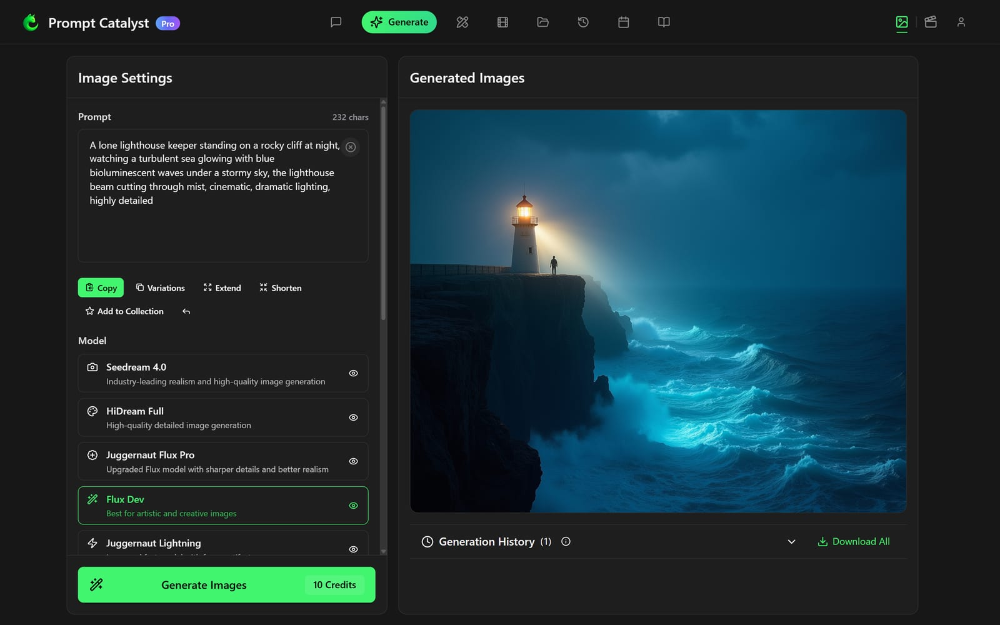
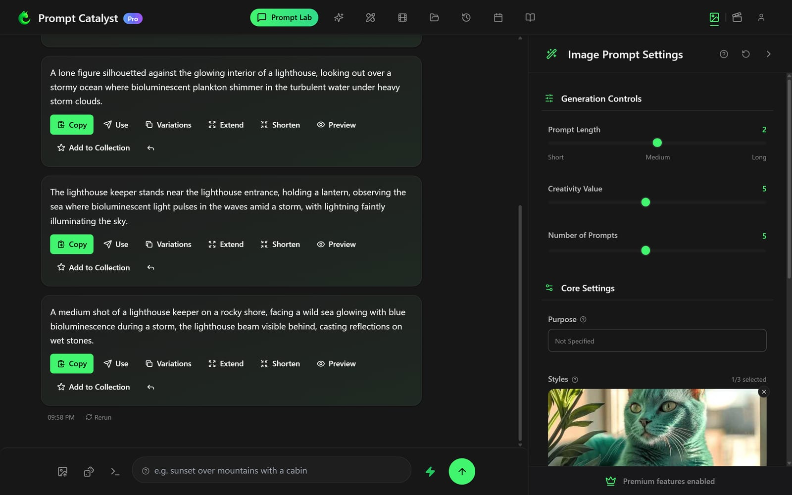

# PromptCatalyst — Web Client

Frontend for [PromptCatalyst](https://promptcatalyst.ai), an AI platform for prompt optimization and image/video generation. The live product reached 10,000+ registered users.

**Live:** https://promptcatalyst.ai

> This repository contains the **React frontend** only. The backend API is kept in a separate private repository.

*Image generation — multi-model selector (Flux, Seedream, Juggernaut…) with a live result:*



*The Prompt Lab optimizing a subject into ready-to-use image prompts:*



## Overview

A single-page React application covering the whole user-facing product: authentication, the prompt-optimization workflow, image and video generation, subscription management and account settings.

## Features

- Prompt optimization interface
- AI image and video generation flows
- Authentication and account management
- Stripe-powered subscriptions and billing UI
- Polished UX: animated transitions, toast notifications, bulk export

## Tech stack

| Area | Technology |
|------|------------|
| Framework | React 18 (Create React App) |
| Routing | React Router 7 |
| State | Zustand, React context |
| Styling | Tailwind CSS, Framer Motion |
| UI | Radix UI, Headless UI, Lucide icons |
| Auth | Supabase (email/password and Google) |
| Payments | Stripe Checkout |
| Networking | Axios |
| Testing | Jest, Testing Library |

## How it fits together

Every view is a real route, so the app is deep-linkable and the back button
behaves. The API is served from the same origin under `/api`, which means no
CORS layer and no second domain to keep in sync.

```
src/
  components/   screens and UI, one file per view
  contexts/     cross-cutting state: auth, credits, collections, theme
  hooks/        the long-running flows — generation, polling, history
  services/     everything that talks to the outside world
  utils/        pure helpers
```

Three decisions worth calling out, because they are the ones that shaped the code:

**Views are code-split, then prefetched.** Ten screens load on demand, so the
first paint does not carry all of them. Splitting alone just moved the wait to
the first click, so the chunks are warmed once the browser goes idle — and
skipped entirely on a metered or 2G connection.

**One bearer token, two possible issuers.** `tokenService` prefers a live
Supabase session and falls back to a legacy token, so a provider migration did
not sign anybody out. It refuses an expired or malformed session rather than
sending a dead token. This is the most safety-critical logic in the client and
it is the most heavily tested.

**Failures are told apart before they are shown.** Supabase reports "wrong
password" and "this account has no password yet" identically. Asking them apart
server-side would mean an endpoint that reveals which addresses have accounts,
so the client shows one honest message that offers a way forward instead.

## Running locally

```bash
git clone https://github.com/vahanghazaryan03/prompt-catalyst-web.git
cd prompt-catalyst-web
npm install
cp .env.example .env   # then add your own values
npm start
```

Runs at http://localhost:3000. Full functionality requires the backend API, which is not part of this repository.

## Scripts

```bash
npm start        # dev server
npm test         # Jest + Testing Library
npm run build    # production bundle
npm run lint     # ESLint
npm run lint:fix # ESLint with --fix
```
